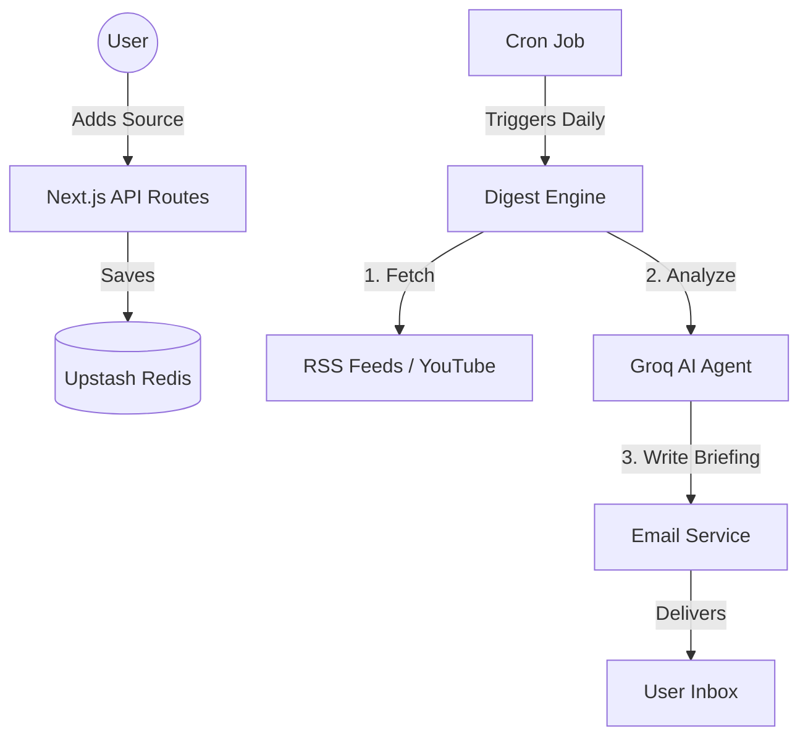

# System Architecture: The "Serverless Core"

You asked: *"Do we have a proper backend?"*

**Answer: Yes, you have a modern "Serverless Backend".**

Instead of a traditional always-on server (like an old Linux box running 24/7), your system uses **Next.js API Routes** which spin up instantly on demand. This is the industry standard for modern newsletters and lightweight apps.

## The Stack

| Component | Technology | Purpose |
| :--- | :--- | :--- |
| **The Brain (AI)** | **Groq (Llama 3.3 70B)** | The "Executive Editor" that writes the digests. Extremely fast logic. |
| **The Memory (DB)** | **Upstash Redis** | A specialized high-speed database that stores User Preferences & Source Lists. |
| **The Engine (Backend)** | **Next.js (Serverless)** | Handles all logic: `cron` jobs, `subscribe` API, and data fetching. |
| **The Courier** | **SendGrid / Resend** | Delivers the emails reliably. |

## Data Flow

## Why this is "Proper"
1.  **Scale**: It can handle 1 user or 10,000 users without crashing.
2.  **Cost**: You pay $0 when no one is using it (unlike a traditional server).
3.  **Speed**: Redis + Groq is one of the fastest combinations available today.

**Verdict**: You do not need "more" backend. This is a production-grade architecture for this specific use case.
